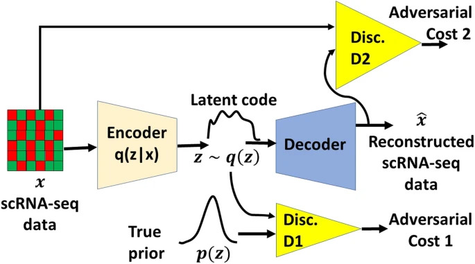

# Adversarial-Variational-Autoencoder-on-single-cell-rna-seq-data

**Dataset**: **[GSE60361](https://www.ncbi.nlm.nih.gov/geo/query/acc.cgi?acc=GSE60361)** *(Mouse neurons dataset)*



*Framework of Adversarial Variational Autoencoder pipeline with dual matching (DRA)*


**Model used**: Adversarial Variational Autoencoder with Dual Matching (AVAE-DM)

**Latent dimensions**: 2, 10, 20  

**Optimizer**: Adam (momentum=0.9)

**Activation function**: Leaky Relu

**Batch Size**: 128

### Evaluation metrics (NMI) for 7 cell types of mouse neurons dataset (Zeisel/GSE60361) 

Latent dimension | NMI | Learning rate | Hidden layers| Hidden unit size                     
---------|-----|-----|---------|---
2 |0.4640|0.0001 | 4 | G=512, D=32
10 |0.7468| 0.0007 | 1 | G=512, D=512
20 |0.7153|0.0007 | 1 | G=512, D=512

where G=Generator and D=Discriminator

**Instructions**: Rename the cloned repository as DRA

## Dependencies

The code has been tested with the following versions of packages.

- Python: 3.8.3
- Tensorflow: 2.3.0
- Numpy: 1.18.5
- Scipy: 1.4.1
- Scikit-learn: 0.23.2


## Code

There are three python files for DRA as follows:

- dra.py
- Util.py
- opts.py

The path for the code could be ./DRA/<python_file_name.py>

We utiize a fixed seed using tf.compat.v1.set_random_seed(0).


## Dataset

The path for the dataset could be ./DRA/data/<dataset_name>

For example, the Zeisel dataset could be in the folder ./DRA/data/Zeisel as follows:

- ./DRA/data/Zeisel/sub_set-720.mtx
- ./DRA/data/Zeisel/labels.txt

The Zeisel dataset consists of 3,005 cells from the mouse brain (as shown in the sub_set-720.mtx file). 

In addition, the Zeisel dataset has the ground truth labels of 7 distinct cell types (as shown in the labels.txt file).

There were 720 highest variance genes selected in the Zeisel dataset.


## Training

For example, a model can be trained using the command as follows:

```bash
$ python dra.py --model dra --batch_size 128 --learning_rate 0.0001 --beta1 0.9 --n_l 4 --g_h_l1 512 --g_h_l2 512 --g_h_l3 512 --g_h_l4 512 --d_h_l1 32 --d_h_l2 32 --d_h_l3 32 --d_h_l4 32 --bn True --actv sig --trans sparse --keep 0.9 --leak 0.2 --lam 1.0 --epoch 200 --z_dim 2 --train --dataset Zeisel
```
The above model is trained using the hyperparameters as follows:

- Latent dimensions = 2 (using the option --z_dim)
- Batch size = 128 (using the option --batch_size)
- Learning rate = 0.0001 (using the option --learning_rate)
- Hidden layer = 4 (using the option --n_l)
- Hidden unit for the generator = 512/512/512/512 (using the option --g_h_l1, --g_h_l2, --g_h_l3, and --g_h_l4)
- Hidden unit for the discriminator = 32/32/32/32 (using the option --d_h_l1, --d_h_l2, --d_h_l3, and --d_h_l4)

The performance will be written to ./DRA/Res_DRA/tune_logs/Metrics_Zeisel.txt along with timestamp.

We assess the clustering performance using the normalized mutual information (NMI) scores (as shown in the Metrics_Zeisel.txt file).


Furthermore, another model can be trained using the command as follows:

```bash
$ python dra.py --model dra --batch_size 128 --learning_rate 0.0007 --beta1 0.9 --n_l 1 --g_h_l1 512 --d_h_l1 512 --bn False --actv sig --trans sparse --keep 0.9 --leak 0.2 --lam 1.0 --epoch 200 --z_dim 10 --train --dataset Zeisel
```
The second model is trained using the hyperparameters as follows:

- Latent dimensions = 10 (using the option --z_dim)
- Batch size = 128 (using the option --batch_size)
- Learning rate = 0.0007 (using the option --learning_rate)
- Hidden layer = 1 (using the option --n_l)
- Hidden unit for the generator = 512 (using the option --g_h_l1)
- Hidden unit for the discriminator = 512 (using the option --d_h_l1)

Again, the performance will be written to ./DRA/Res_DRA/tune_logs/Metrics_Zeisel.txt along with timestamp.

We assess the clustering performance using the normalized mutual information (NMI) scores (as shown in the Metrics_Zeisel.txt file).

Moreover, there are several other options as follows:

- Epoch to train (using the option --epoch)
- Momentum term of the ADAM algorithm (using the option --beta1)
- Activation function for the decoder (using the option --actv)
- Leak factor (using the option --leak)
- Keep probability (using the option --keep)
- Data transformation (using the option --trans)
- Batch normalization (using the option --bn)
- Lambda for regularization (using the option --lam)
- Dataset name (using the option --dataset)
- Generator hidden units in layer 1 (using the option --g_h_l1)
- Generator hidden units in layer 2 (using the option --g_h_l2)
- Generator hidden units in layer 3 (using the option --g_h_l3)
- Generator hidden units in layer 4 (using the option --g_h_l4)
- Discriminator hidden units in layer 1 (using the option --d_h_l1)
- Discriminator hidden units in layer 2 (using the option --d_h_l2)
- Discriminator hidden units in layer 3 (using the option --d_h_l3)
- Discriminator hidden units in layer 4 (using the option --d_h_l4)


**Reference**: [A deep adversarial variational autoencoder model for dimensionality reduction in single-cell RNA sequencing analysis](https://bmcbioinformatics.biomedcentral.com/articles/10.1186/s12859-020-3401-5)
