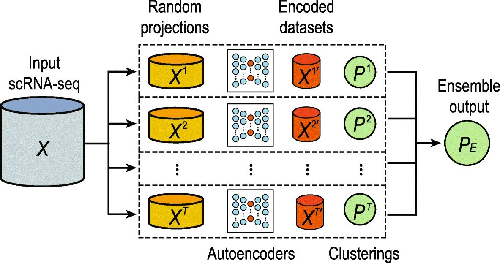
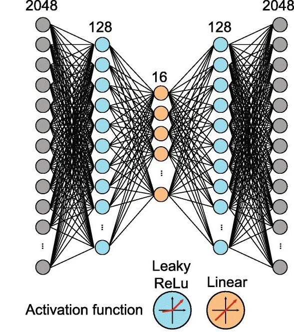
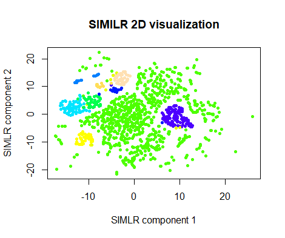
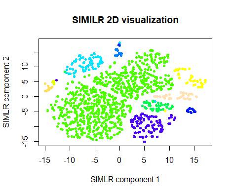

# Autoencoder-Cluster-ensemble-on-single-cell-rna-seq

## Implementation of Autoencoder pipeline on single-cell RNA-seq datasets

*Framework of autoencoder pipeline*



**Datasets used:**
1. **[GSE60361](https://www.ncbi.nlm.nih.gov/geo/query/acc.cgi?acc=GSE60361) for optimization** 
2. **[GSE 82187](https://www.ncbi.nlm.nih.gov/geo/query/acc.cgi?acc=GSE82187) for evaluation**
3. **[pbmc3k](https://support.10xgenomics.com/single-cell-gene-expression/datasets/1.1.0/pbmc3k) for evaluation**

**Hyperparameters used**
1. 2048 genes during random projection
2. 16-dimensional encoded feature space size 
3. Learning rate= 0.001
4. Hidden layer width (no. of nodes/neurons)= 128




  
### Evaluation Metrics for GSE 82187 dataset (**SIMLR**)
Datasets | ARI | NMI | Jaccard | FM
---------|-----|-----|---------|---
Original Dataset | 0.5172969 | 0.7977766 | 0.5161573 | 0.7177576
GSE82187 (754 genes)| 0.2240068 | 0.4784256 | 0.2780965 | 0.4876007



*SIMLR results for 754 genes GSE82187 dataset*



*SIMLR results for the original dataset GSE82187*

### Evaluation Metrics for GSE 82187 dataset (754 genes) [**kmeans**]
Datasets | ARI | NMI | Jaccard | FM
---------|-----|-----|---------|---
GSE82187 (754 genes)| 0.4698909 |  0.5627964 |  0.4832698 | 0.6850336

### Evaluation Metrics for GSE 82187 dataset (754 genes) 

**Using Autoencoder + kmeans clustering (with 10 centers for 10 classes)**    ```[with normalization]```
Ensemble size | ARI | NMI | Jaccard | FM                     
---------|-----|-----|---------|---
Ensemble size=1 | 0.2341229 | 0.456196 | 0.2497106| 0.4839834
Ensemble size=5 | 0.349188 | 0.5104788 | 0.354307 | 0.5894739
Ensemble size=10 | 0.3375219 | 0.5259057 | 0.3467349 | 0.5798687
Ensemble size=20 | 0.2729846 | 0.4793365 | 0.2869585 | 0.5221253
Ensemble size=50 | 0.2932487 | 0.4861091 | 0.3066573 | 0.5410244

**Using Autoencoder + SIMLR (with 10 centers for 10 classes)**    ```[with normalization]```
Ensemble size | ARI | NMI | Jaccard | FM                     
---------|-----|-----|---------|---
Ensemble size=1 | 0.2554089 | 0.47612 | 0.2674771 |  0.5047795
Ensemble size=5 | 0.3244865 | 0.51312 | 0.3348787 | 0.5686795
Ensemble size=10 |0.3238857 |0.5088121 | 0.3335808 | 0.5680714
Ensemble size=20 | 0.3234006|  0.5012284| 0.3360806 | 0.5680259
Ensemble size=50 | 0.3152517| 0.4987262| 0.3282467 | 0.5608709

### Evaluation Metrics for pbmc3k dataset (2000 genes) 

**Using Autoencoder + kmeans clustering (with 9 centers for 9 classes)**    ```[with normalization]```
Ensemble size | ARI | NMI | Jaccard | FM                     
---------|-----|-----|---------|---
Ensemble size=1 | 0.5885635 |0.6757968 | 0.4814628 | 0.6553263
Ensemble size=5 | 0.5859871 | 0.7020181 | 0.4836724 | 0.6535111
Ensemble size=10 | 0.653553 |0.7415183 | 0.5508047 | 0.7109683
Ensemble size=20 | 0.6344714 | 0.7299742  | 0.5308086 | 0.6945936
Ensemble size=50 | 0.6692461 | 0.7493144 | 0.5656396 | 0.7237732


### Evaluation Metrics for pbmc3k dataset (**SIMLR**)
Datasets | ARI | NMI | Jaccard | FM
---------|-----|-----|---------|---
pbmc3k | 0.5024867 | 0.6764282 | 0.4412209 | 0.6397836

### Evaluation Metrics for pbmc3k dataset (2000 genes) 

**Using Sparse Autoencoder + kmeans clustering (with 9 centers for 9 classes)**    ```[with normalization]```
Ensemble size | ARI | NMI | Jaccard | FM                     
---------|-----|-----|---------|---
Ensemble size=1 | 0.5738043 | 0.6818387|  0.479387 | 0.648203
Ensemble size=5 | 0.5894394 | 0.7411178 | 0.4981322 | 0.6669235
Ensemble size=10 | 0.6723159 |0.7429124 | 0.5679916 | 0.7262372
Ensemble size=20 | 0.673469 | 0.748463 | 0.5707871 | 0.7275293
Ensemble size=50 | 0.7032308 |0.7684664  | 0.6023328 |  0.7525159


The script r_autoencoder.R comprises two functions, described below.

## encode

**Description**

Generates an encoded subspace of a single-cell RNA-seq expression matrix.

**Usage**

```
encode(dat, seed = 1, max_random_projection = 2048, encoded_dim = 16, hidden_dims = c(128), 
  learning_rate = 0.001, batch_size = 32, epochs = 100, verbose = 1, scale = FALSE,
  genes_as_rows = FALSE)
```

**Arguments**

```
dat                     A matrix, data frame or tibble containing scRNA-seq expression values. By default,
                        genes are assumed to be represented by columns and samples are assumed to be 
                        represented by rows (but see the argument genes_as_rows). NA values are not  
                        supported, but may be replaced by 0s.

seed                    Random seed for initial gene sampling. Currently a seed cannot 
                        be set to reproducibly determine the behaviour of the autoencoder artificial 
                        neural network. 

max_random_projection   Determines the maximum number of genes to be initially sampled prior to 
                        autoencoder training. In practice the number of genes sampled is equal to this 
                        number or 80% of the genes present in the matrix (rounded up), whichever is 
                        smaller.

encoded_dim             The number of features in the encoded data.

hidden_dims             A vector of 1 or more integers, representing the number of nodes in each 
                        successive hidden layer of the encoder half of the autoencoder. Hidden layers in 
                        the decoder use these widths in reverse.

learning_rate           Learning rate for training the artificial neural network.

batch_size              Number of samples per training batch.

epochs                  Number of training epochs.

verbose                 Determines the verbosity of the keras training function. 
                        0: Silent.
                        1: Progress bar.
                        2: One line per epoch.

scale                   If TRUE, gene values are rescaled to a mean of 0 and a standard deviation of 1.

genes_as_rows           If TRUE, rows in the expression matrix are assumed to represent genes and columns 
                        are assumed to represent cells.
```

**Details**

This function accepts a single scRNA-seq expression matrix, randomly samples a number of genes without replacement and trains an autoencoder artificial neural network on the resulting data. The function uses part of this network to encode cell data within a lower-dimensional latent space and returns the encoded matrix. This function does not need to be called directly by the user for clustering (see ensemble_cluster function below), but is provided for greater flexibility.

It is not recommended to run this function in parallel as model training makes use of resources in parallel (CPU cores or GPU, depending on computer setup).

**Value**

An encoded expression matrix wherein cells are represented by rows and latent features are represented by columns.


## ensemble_cluster

**Description**

Generates an ensemble clustering of a single-cell RNA-seq expression matrix.

**Usage**

```
ensemble_cluster(dat, seed = 1, cluster_func = function(x) kmeans(x, centers=5), 
  ensemble_sizes = c(1, 5, 10, 20, 50), cores = 1, ...)
```

**Arguments**

```
dat                 A matrix, data frame or tibble containing scRNA-seq expression values. By default, 
                    genes are assumed to be represented by columns and samples are assumed to be 
                    represented by rows (but see the argument genes_as_rows under the encode function). 
                    NA values are not supported, but may be replaced by 0s.

seed                Used to generate random seeds for the encode function and acts as a random seed 
                    for stochastic clustering functions.

cluster_func        Any function which will accept a matrix (rows as samples, columns as features) and 
                    return a clustering object such as that returned by the kmeans function.

enzemble_sizes      A vector of integers. Number of individual clusterings to be used in each ensemble 
                    clustering returned.

cores               Number of CPU cores to be used in parallel for individual and ensemble clustering.

...                 Optional arguments to be passed to the encode function.
```

**Details**

This function accepts a single scRNA-seq expression matrix. The encode function is used to produce multiple encodings of the data. These are separately clustered using a clustering function optionally provided by the user and produces a set of consensus clusters from these individual clusterings using the clue package, which are returned to the user.

**Value**

A list of length len(ensemble_sizes) containing vectors of consensus clusters per cell. Each ensemble clustering is generated using a number of individual clusterings given by the corresponding element in the ensemble_sizes argument.


R version 4.0.2 (2020-06-22)

Bioconductor version ‘3.11’

**Libraries and Packages used**
```
Biobase
GEOquery
data.table
keras
clue
parallel
mclust
aricode
clusterCrit
SIMLR
```


Reference [Autoencoder-based cluster ensembles for single-cell RNA-seq data analysis](https://bmcbioinformatics.biomedcentral.com/articles/10.1186/s12859-019-3179-5)
